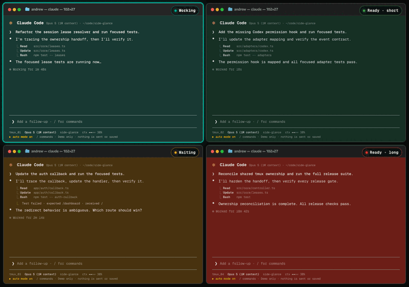

<div align="center">

<h1>Side Glance</h1>

<p><strong>Long loops. Short glances.</strong></p>

<p>See whether each coding-agent session is working, waiting, ready, or failed<br>
without reopening every terminal tab or pane.</p>

<p>Side Glance turns local coding-agent lifecycle events into terminal color and tmux markers.<br>
No dashboard. No hosted relay. No conversation content in its state protocol.</p>

<a href="https://www.npmjs.com/package/side-glance"></a>
<a href="https://github.com/AndrewUlloa/side-glance/releases/latest"></a>
<a href="https://github.com/AndrewUlloa/side-glance/blob/main/LICENSE"></a>

</div>

<p align="center">
  
</p>

<p align="center">
  <sub><strong>Heat theme shown.</strong> Warmer Ready means a longer successful turn. In default Status, Ready stays green and red means failure.</sub>
</p>

[Install](#install) · [Lifecycle](#lifecycle) · [Providers](#provider-support) · [Safety](#safety-privacy-and-recovery) · [Documentation](#documentation)

## Four sessions. One clear glance.

You start a few agents, then return to another task. One finishes. Another needs
permission. A third fails. Without a shared signal, you end up reopening every
session just to learn what changed.

Side Glance keeps the best-known state on the surface where the work is already
running:

```text
API refactor       ● Working
Auth migration     ! Waiting
Test cleanup       ✓ Ready
Release build      × Failed
```

Color reinforces the state in a direct terminal. Distinct markers carry the same
meaning in tmux, so color is never the only signal.

## How it works

1. **Review setup.** `side-glance init` detects supported provider CLIs without
   launching them and shows what it will change before it writes.
2. **Work normally.** Start Claude Code, Codex, or another configured CLI as you
   usually do. Use the supervised wrapper when a detached or unusual launch has
   no safely discoverable terminal.
3. **Glance at the state.** Side Glance reduces supported lifecycle events into
   Working, Waiting, Ready, Failed, or Inactive and renders that state in terminal
   or tmux.

The Side Glance CLI runs locally and does not operate a hosted service or collect
telemetry. Prompts, responses, and transcripts are not protocol fields or saved
state.

## Install

Side Glance v0.1 is stable. Stable releases are published on npm's explicit
`latest` channel. Homebrew is the recommended durable installation for Apple
Silicon macOS and glibc Linux:

```bash
brew install AndrewUlloa/tap/side-glance
side-glance init
```

The Homebrew formula installs a standalone build. Intel macOS is experimental;
Windows and musl/Alpine Linux are not supported in v0.1.

Setup offers a provider only when its CLI command is executable on the current
shell's `PATH`. Its account or desktop app may still be usable without that
command, but the app alone cannot receive terminal lifecycle integration.

To inspect Side Glance before installing it permanently:

```bash
npx side-glance@latest init
```

The temporary runner performs read-only discovery, then hands off to an existing
durable executable or asks before installing the exact stable release. It never
writes an npm-cache path into provider hooks.

Global npm is the durable fallback and requires Node.js 22 or newer:

```bash
npm install --global side-glance@latest
side-glance init
side-glance --version
```

Direct downloads, provenance, and `SHA256SUMS` are available from
[GitHub Releases](https://github.com/AndrewUlloa/side-glance/releases).

### Review setup

`side-glance init` presents one read-only review of detected providers,
notifications, warnings, owned configuration paths, and colors before changing
anything. It is safe to rerun. `side-glance setup` is its exact alias.

**Recommended** uses **Status** without an additional color prompt. **Customize**
lets you choose providers, notifications, and colors. Rerunning setup preserves an
existing saved theme.

Use Up/Down to move, Space to toggle, and Enter to continue. Set
`SIDE_GLANCE_ACCESSIBLE=1` for a static numbered prompt. Non-TTY input is
noninteractive and requires explicit automation flags.

Preview an automated setup before approving the same plan:

```bash
side-glance setup --dry-run
side-glance setup --providers claude,codex --notifications none --fresh-tabs --yes --json
```

### Start your agents normally

After setup, normally run `claude`, `codex`, or the experimental `gemini` as usual:

```bash
claude
codex
gemini # experimental
```

For supported local launches, Side Glance discovers the originating terminal from
tmux identity or bounded process ancestry. It paints only after the target passes
owned character TTY checks. Discovery is supported, not guaranteed: desktop-only
and detached sessions remain targetless instead of painting the wrong window.

`side-glance run` is the explicit fallback when discovery is unavailable or when
you want a private notification label:

```bash
side-glance run --label "Codex" -- codex
```

Package upgrades do not rewrite provider hooks. Rerun `side-glance init` after
upgrading; `side-glance doctor --json` reports when an installed integration needs
a refresh.

## Lifecycle

The default **Status** theme keeps successful work green. Red means failure.
Status uses Working cyan, Waiting amber, Ready green, Failed red, and Inactive
neutral.

| State | Default | tmux | What it means |
|---|---|---:|---|
| Inactive | neutral | — | No owned active lifecycle state |
| Working | cyan | `●` | The agent is processing |
| Waiting | amber | `!` | The agent needs attention |
| Ready | green | `✓` | The best-known turn is ready for review |
| Failed | red | `×` | The provider or supervised process failed |

Ready is the best state exposed by the current provider lifecycle. Some provider
hooks are pre-final and may still be followed by a block, retry, or additional
work. Side Glance preserves those provider-specific boundaries instead of claiming
absolute completion.

## Why Side Glance is shaped this way

### Status stays where the work runs

Side Glance uses the terminal or tmux surface you already have. It does not add a
command center you must keep open, and it does not need a hosted relay.

### Persistent state complements notifications

A notification is transient. Side Glance keeps the latest lifecycle state visible
until a newer event replaces it. Optional desktop notifications remain a separate
channel and default conservatively when a provider already has native alerts.

### Conversation content stays out of the controller

Side Glance operates on lifecycle metadata. Prompt, response, and transcript
content is neither part of the protocol nor persisted state. Private wrapper labels
stay local; without a label, notifications use a privacy-safe session digest.

### A small signal still needs strong ownership rules

Shared terminal surfaces can receive late events from several sessions. Side
Glance rejects older generations, timestamps, turn IDs, and duplicate event IDs.
One session owns a shared surface at a time; releasing it reveals the next owner
instead of erasing unrelated work.

## Provider support

Claude Code and Codex are locally contract-audited. Gemini, OpenCode v1, and Aider
remain experimental until their live binary matrices pass.

| Provider | Lifecycle integration | Notification boundary | Status |
|---|---|---|---|
| Claude Code | Native hooks; known subagent and background work delays Ready | Attention and failure; pre-final Ready stays silent | Contract-audited |
| Codex | Native hooks with safe terminal discovery | Attention; pre-final Ready stays silent | Contract-audited |
| Gemini | Native hooks with safe terminal discovery | Attention; pre-final Ready stays silent | Experimental |
| OpenCode v1 | Stable v1 plugin API | Ready, attention, and failure | Experimental |
| Aider | Static notification callback paired with the wrapper | Completion bridge only | Experimental |
| Any CLI | Supervised wrapper | Process exit only when `--notify-on-exit` is selected | Supported fallback |

OpenCode's incompatible `opencode2` beta fails closed. Existing provider hooks and
notification commands are preserved during setup and uninstall.

Claude reports attention and failure. Codex and Gemini report attention through
their installed integrations. The generic wrapper reports process exit only when
`--notify-on-exit` is selected.

Known subagent and background work delays Ready. Claude tracks that work plus
session-cron state; missing or malformed registries mean unknown, not empty.
Claude and Codex `Stop` plus Gemini `AfterAgent` remain pre-final hooks, so they do
not produce a misleading final Ready notification.

## Commands

| Command | Use it to… |
|---|---|
| `side-glance init` | Discover providers and review one guided setup |
| `side-glance setup` | Run the exact alias for `init` |
| `side-glance doctor --json` | Inspect providers, hooks, targets, overrides, and readiness |
| `side-glance theme` | Choose Status, Heat, or custom lifecycle colors |
| `side-glance preview ... --json` | Resolve an appearance without painting a terminal |
| `side-glance run -- <command>` | Supervise a CLI when direct discovery is unavailable |
| `side-glance install <provider> --json` | Install or update one provider integration |
| `side-glance uninstall <provider> --json` | Remove one Side Glance-owned integration |
| `side-glance status --json` | Read the reduced lifecycle state without painting |
| `side-glance reset --all --json` | Release leases and restore owned appearance state |

Run `side-glance --help` or a subcommand's help for complete options. `event` and
`hook` are managed provider entry points, not manual setup commands.

## Themes

- **Status** is the default semantic palette shown above.
- **Heat** maps successful Ready duration from green through amber to red.
- **Custom** accepts one validated wash/accent pair per lifecycle state.

```bash
side-glance theme show --json
side-glance theme set status --yes --json
side-glance theme set heat --ceiling adaptive --yes --json
side-glance preview --phase completed --elapsed 300 --source claude --json
```

Adaptive Heat learns separately for each provider from the newest 12 eligible
completed turns. It stores turn identity and duration, not prompts, commands,
responses, paths, or transcripts. Invalid theme configuration falls back to
Status and remains visible in `side-glance doctor --json`.

## Desktop notifications

Provider-native and Side Glance notifications are separate channels. When native
notifications are ready, Side Glance defaults off. When the native notification
state is unknown, Side Glance also defaults off and explains the uncertainty. It
defaults on only when native alerts are disabled and a supported operating-system
backend is available.

macOS uses the installed sound `Glass` by default and accepts another bounded
installed sound name. Linux sound is best-effort. Setup does not fire a test
notification, so configuration alone is not proof that the computer played a
sound.

```bash
side-glance install claude --notifications --notification-sound Glass --json
side-glance run --label "API worker" -- claude
side-glance run --label "Release build" --notify-on-exit -- your-command
```

## Safety, privacy, and recovery

Side Glance treats provider events, session IDs, paths, labels, and saved state as
untrusted input.

- State is typed JSON. It is never sourced or evaluated as shell code.
- Terminal bytes are written only after the target is verified as an owned
  character TTY.
- Older events cannot repaint a newer generation.
- Releasing one session removes only its lease and recomputes the shared surface.
- Setup previews owned changes and preserves unrelated provider hooks and
  notification commands.
- Owned files are backed up, written atomically, and verified.
- Reset restores Side Glance-owned appearance state only.
- Terminal-title mutation is opt-in.

Normal session end, child exit, `SIGINT`, `SIGTERM`, `SIGHUP`, and manual reset
paths release through the serialized controller. A caught multi-provider setup
failure rolls back applied providers only while their files still match what that
setup wrote; a newer external edit produces a conflict instead of being
overwritten.

No software can guarantee synchronous cleanup after power loss, `SIGKILL`, or a
terminal-emulator failure. Side Glance handles those cases through reconciliation
on the next affected event and explicit recovery:

```bash
side-glance reset --all --json
```

OSC 111 restores the terminal's configured default background, not an unknowable
prior dynamic OSC 11 value. The next `side-glance init` or `side-glance doctor`
reports partial setup and recovery conditions so idempotent setup can repair them.

Report vulnerabilities privately through
[GitHub Security Advisories](https://github.com/AndrewUlloa/side-glance/security/advisories/new).
Read [SECURITY.md](./SECURITY.md) before reporting.

## Uninstall

Remove the managed integrations that apply to your setup before removing the
executable:

```bash
side-glance uninstall claude --json
side-glance uninstall codex --json
side-glance uninstall gemini --json
side-glance uninstall opencode --json
side-glance reset --all --json

# Then remove the package installed by one of these methods:
brew uninstall side-glance
npm uninstall --global side-glance
```

Uninstall preserves unrelated provider hooks and shell configuration. If you
enabled the managed fresh-tab block, rerun setup with `--no-fresh-tabs` before
removing the executable.

## Troubleshooting

- Start with `side-glance doctor --json` for redacted provider, hook, target, and
  notification diagnostics.
- If a provider is missing, expose its CLI command to the current shell's `PATH`
  and rerun `side-glance init`.
- If direct discovery cannot find the correct terminal, use
  `side-glance run -- <command>`.
- After an upgrade, rerun `side-glance init` to refresh owned hooks.
- If appearance survives an interrupted session, run
  `side-glance reset --all --json`.
- macOS Focus, notification settings, and sound availability can suppress alerts.

Use [GitHub Discussions](https://github.com/AndrewUlloa/side-glance/discussions) for
setup questions and the issue templates for reproducible bugs or feature requests.
Never include prompts, transcripts, access tokens, or unredacted provider
configuration in a report.

## Why it exists

Side Glance began as `stoplight.sh`, a personal Claude Code hook Andrew Ulloa built
after repeatedly reopening several agent terminals to see which one was still
working, waiting for input, ready for review, or failed.

The design was influenced by Christopher Roosen's essay on Shisa Kanko and its
broader lesson about external cognition: important operational state is easier to
act on when it is visible in the environment instead of held entirely in memory.
Side Glance is not digital pointing and calling. It applies that narrower design
principle through an ambient terminal signal.

Side Glance originated at Design From, Inc. and is maintained by Andrew as
Apache-2.0 open source. Read
[Christopher Roosen's essay](https://www.christopherroosen.com/blog/2020/4/20/how-the-ritual-of-pointing-and-calling-shisa-kanko-embeds-us-in-the-world)
for the original design influence.

## Try it from source

Repository development uses Node.js 24.18.0:

```bash
git clone https://github.com/AndrewUlloa/side-glance.git
cd side-glance
npm ci
npm run build:cli
node packages/cli/dist/side-glance.mjs doctor --json
node packages/cli/dist/side-glance.mjs run -- claude
```

For a durable installation from a checkout, build first and then run:

```bash
npm install --global ./packages/cli
```

Provider hooks must never point at `npx` or an npm-cache path.

## Documentation

- [Product specification](./SPEC.md)
- [Architecture](./docs/architecture.md)
- [Adapter protocol](./docs/adapter-protocol.md)
- [Edge-case audit](./docs/edge-case-audit.md)
- [CI/CD runbook](./docs/cicd.md)
- [Release process](./docs/releasing.md)
- [Changelog](./CHANGELOG.md)
- [Contributing](./CONTRIBUTING.md)
- [Support](./SUPPORT.md)
- [Security policy](./SECURITY.md)

The CLI and interactive site share the same lifecycle phases and palette. Run the
repository gates with Node.js 24.18.0 before contributing:

```bash
npm run test:unit
npm run test:integration
npm run test:coverage
npm run lint
npm run typecheck
npm run build
npm test
```

## Project

- [sideglance.dev](https://sideglance.dev)
- [Source](https://github.com/AndrewUlloa/side-glance)
- [Issues](https://github.com/AndrewUlloa/side-glance/issues)
- [Discussions](https://github.com/AndrewUlloa/side-glance/discussions)
- [npm](https://www.npmjs.com/package/side-glance)
- [Releases](https://github.com/AndrewUlloa/side-glance/releases)

Stable · v0.1. Gemini, OpenCode v1, and Aider remain experimental until their live
provider matrices are signed off.

## License

Apache-2.0
